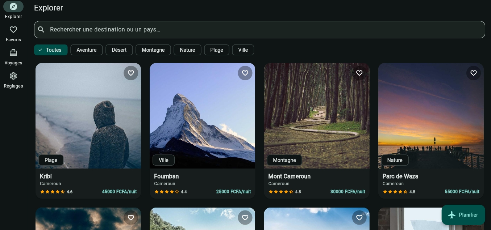
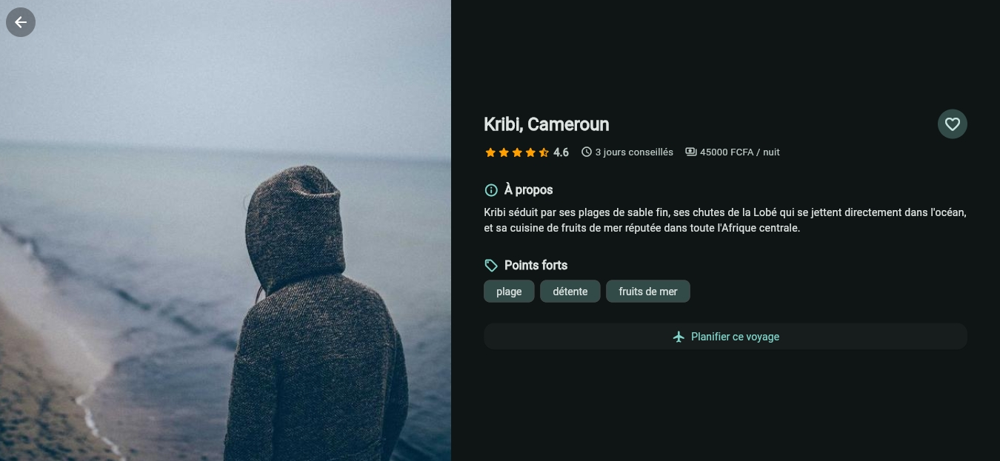
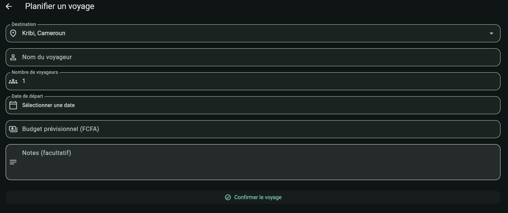
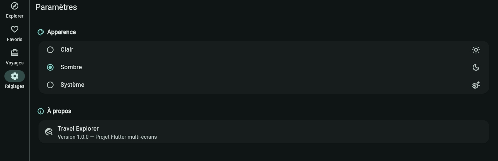

# 🌍 Travel Explorer

Application Flutter multi-écrans pour découvrir, filtrer et planifier des voyages.
Projet réalisé dans le cadre de la validation des compétences Flutter & navigation.

## ✨ Fonctionnalités

- **Explorer** : liste/grille de destinations avec recherche en temps réel et filtrage par catégorie
- **Détail** : fiche complète d'une destination (photo, note, description, tags, prix) reçue via paramètre de route
- **Planifier un voyage** : formulaire avec validation sur 6 champs (nom, nombre de voyageurs, date, budget, destination, notes)
- **Favoris** : destinations enregistrées, avec état persistant durant la session
- **Mes voyages** : liste des voyages planifiés, avec suppression
- **Paramètres** : bascule thème clair / sombre / système
- **Responsive** : navigation en `NavigationBar` (mobile) ou `NavigationRail` (tablette/desktop), grilles à 2/3/4 colonnes selon la largeur d'écran

## 🖼️ Captures d'écran

_À ajouter dans `screenshots/` puis référencer ici, par ex. :_

| Explorer | Détail | Formulaire | Thème sombre |
|---|---|---|---|
|  |  |  |  |

## 🏗️ Architecture

```
lib/
├── main.dart                  # Point d'entrée, ProviderScope
├── app.dart                   # MaterialApp.router, thèmes
├── models/                    # Destination, Trip — aucune donnée en dur
├── data/                      # (réservé, extension future)
├── services/
│   └── destination_repository.dart   # Charge assets/data/destinations.json
├── providers/                 # État Riverpod (thème, filtres, favoris, voyages)
├── router/
│   └── app_router.dart        # GoRouter — routes nommées, StatefulShellRoute
├── theme/
│   └── app_theme.dart         # Thèmes clair/sombre (Material 3)
├── utils/
│   └── responsive.dart        # Points de rupture mobile/tablette/desktop
├── widgets/                   # Composants réutilisables
│   ├── destination_card.dart
│   ├── category_filter_bar.dart
│   ├── rating_stars.dart
│   └── section_title.dart
└── screens/
    ├── shell/app_shell.dart           # Navigation adaptative (4 onglets)
    ├── explorer/explorer_screen.dart  # Liste/grille + recherche/filtre
    ├── detail/destination_detail_screen.dart
    ├── trip/plan_trip_screen.dart     # Formulaire avec validation
    ├── favorites/favorites_screen.dart
    ├── trips/trips_screen.dart
    └── settings/settings_screen.dart
assets/data/destinations.json  # Toutes les données — séparées du code UI
```

**Séparation UI/données** : aucun widget ne contient de données codées en dur.
Tout provient de `assets/data/destinations.json`, chargé par
`DestinationRepository` et exposé via des providers Riverpod
(`destinationsProvider`, `filteredDestinationsProvider`, `categoriesProvider`).

**Navigation** : [go_router](https://pub.dev/packages/go_router) avec
`StatefulShellRoute.indexedStack` (4 onglets à état préservé) et des routes
nommées poussées par-dessus la coquille : `/destination/:id` (paramètre de
chemin) et `/plan-trip?destinationId=...` (paramètre de requête optionnel).

**State management** : [flutter_riverpod](https://pub.dev/packages/flutter_riverpod)
(`StateNotifierProvider`, `FutureProvider`, `Provider` dérivés).

**Widgets utilisés** (≥ 8) : `ListView`, `GridView`/`SliverGrid`, `Stack`,
`Card`, `Chip`/`ChoiceChip`, `Hero`, `Form`/`TextFormField`,
`DropdownButtonFormField`, `NavigationBar`/`NavigationRail`, `CustomScrollView`
avec `SliverAppBar`, `CircularProgressIndicator`, `AlertDialog`/`SnackBar`.

## 🚀 Installation et lancement

Ce dépôt contient le **code source Dart complet** (`lib/`), les **données**
(`assets/`), la **config web** (`web/`) et le `pubspec.yaml`. Les dossiers
natifs `android/` et `ios/` ne sont pas versionnés (générés par Flutter) —
à créer une seule fois avec la commande ci-dessous.

### Prérequis
- [Flutter SDK](https://docs.flutter.dev/get-started/install) ≥ 3.22 (Dart ≥ 3.3)
- Un émulateur/simulateur, un appareil physique, ou Chrome pour le web

### Étapes

```bash
# 1. Cloner le dépôt
git clone https://github.com/<votre-utilisateur>/travel_explorer.git
cd travel_explorer

# 2. Générer les dossiers de plateforme natifs (android/ios/macos/windows/linux)
#    → ne touche pas à lib/, pubspec.yaml ni web/ déjà présents
flutter create --platforms=android,ios .

# 3. Installer les dépendances
flutter pub get

# 4. Lancer l'application
flutter run                # sur un appareil/émulateur connecté
# ou, sans rien installer d'autre :
flutter run -d chrome      # directement dans le navigateur (web/ déjà fourni)
```

### Tests

```bash
flutter test
```

## 🗂️ Modèle de données

`assets/data/destinations.json` — tableau d'objets avec `id`, `name`,
`country`, `category`, `imageUrl`, `description`, `rating`, `pricePerNight`,
`durationDays`, `tags`. Ajouter une destination = ajouter une entrée JSON,
aucun changement de code requis.

## 📦 Dépendances principales

| Package | Rôle |
|---|---|
| `go_router` | Navigation déclarative, routes nommées, paramètres |
| `flutter_riverpod` | Gestion d'état |
| `cupertino_icons` | Icônes |

## 📄 Licence

Projet pédagogique — libre d'utilisation.
